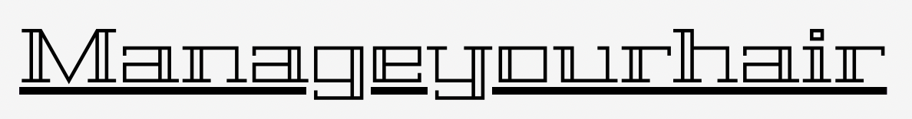

<div id="top"></div>
<!--
*** Thanks for checking out the Best-README-Template. If you have a suggestion
*** that would make this better, please fork the repo and create a pull request
*** or simply open an issue with the tag "enhancement".
*** Don't forget to give the project a star!
*** Thanks again! Now go create something AMAZING! :D
-->


<!-- PROJECT SHIELDS -->
<!--
*** I'm using markdown "reference style" links for readability.
*** Reference links are enclosed in brackets [ ] instead of parentheses ( ).
*** See the bottom of this document for the declaration of the reference variables
*** for contributors-url, forks-url, etc. This is an optional, concise syntax you may use.
*** https://www.markdownguide.org/basic-syntax/#reference-style-links
-->


<!-- PROJECT LOGO -->
<br />
<div align="center">
  <a href="https://github.com/pinkishincoloragain/manageyourhair">
    
  </a>

<h2 align="center">Manageyourhair</h2>

  <p align="center">
    Manageyourhair helps clients find nearest hairshop, and help making reservation.
    <br />
    <br />
    <a href="https://github.com/pinkishincoloragain/manageyourhaur">View Demo</a>
    </p>
</div>


<!-- TABLE OF CONTENTS -->
<details>
  <summary>Table of Contents</summary>
  <ol>
    <li>
      <a href="#about-the-project">About The Project</a>
      <ul>
        <li><a href="#built-with">Built With</a></li>
      </ul>
    </li>
    <li>
      <a href="#getting-started">Getting Started</a>
      <ul>
        <li><a href="#prerequisites">Prerequisites</a></li>
        <li><a href="#installation">Installation</a></li>
      </ul>
    </li>
    <li><a href="#usage">Usage</a></li>
    <li><a href="#roadmap">Roadmap</a></li>
    <li><a href="#license">License</a></li>
    <li><a href="#contact">Contact</a></li>
  </ol>
</details>


<!-- ABOUT THE PROJECT -->
## About The Project




### Built With

* [React.js](https://reactjs.org/)
* [Express.js](https://expressjs.com/)
* [Node.js](https://nodejs.org/en/)
* [Redux.js](https://redux.js.org/)
* [Mysql](https://www.mysql.com/)
* [Material UI](https://mui.com/)


<!-- GETTING STARTED -->
## Getting Started

This is an example of how you may give instructions on setting up your project locally.
To get a local copy up and running follow these simple example steps.

### Prerequisites

* npm
  ```sh
  npm install npm@latest -g
  ```
  

### Installation

1. Clone the repo
   ```sh
   git clone https://github.com/pinkishincoloragain/manageyourhair.git
   ```
2. Install NPM packages
   ```sh
   npm install
   ```


<!-- USAGE EXAMPLES -->
## Usage

This is how to set and run the local server and client.

1. Clone the repo
   ```sh
   git clone https://github.com/pinkishincoloragain/manageyourhair.git
   ```
2. Install NPM packages
   ```sh
   npm install
   ```
3. Create Mysql table and load data. (Use configuration in [DB configuration](https://github.com/pinkishincoloragain/manageyourhair/tree/main/DB))
* Make Secrets.json file (same path as `csv_to_python.py`)
    ```sh
    {
        "mysqlPassword": "root" // put your database password here
    }
    ```
* Execute csv_to_python file
    ```sh
    python csv_to_python.py
    ```

4. Connect Database with Server. You should modify [Server.js](https://github.com/pinkishincoloragain/manageyourhair/blob/main/App/Server/Server.js)
   ```sh
   
   var connection = mysql.createConnection({
    host: "localhost", // put your database hostname here
    user: "root", // put your database user here
    password: "root", // put your database password here
    database: "manager", 
    socketPath: "/tmp/mysql.sock", // socketPath may differ from the default path
   });
   
   ```
5. Start your local express server on port 8001
   ```sh
   cd App/Server
   node Server.js
   ```
6. Start your local client on port 3000
   ```sh
   cd App/Client
   npm start
   ```


<!-- Main features -->
## Main features

* Signup
  * Signup new account

* Login
  * session login

* Mypage
  * Check reservation

* List page
  * Search hairshop
  * Sort by score, name or id
  * Make call
  * Get detail about the shop
  * Read reviews

* Make reservation
  * Input form validation check
  * Commit change

* Server
  * Manage CRUD API
  * Protection from SQL injection


<!-- LICENSE -->
## License

Distributed under the MIT License. 


<!-- CONTACT -->
## Contact

Myungbin Son: D21125194@mytudublin.ie <p/>
Jieun Oh : D21125193@mytudublin.ie

Project Link: [https://github.com/pinkishincoloragain/manageyourhair](https://github.com/pinkishincoloragain/manageyourhair)

<p align="right"><a href="#top">back to top</a></p>


<!-- MARKDOWN LINKS & IMAGES -->
<!-- https://www.markdownguide.org/basic-syntax/#reference-style-links -->
[contributors-shield]: https://img.shields.io/github/contributors/pinkishincoloragain/repo_name.svg?style=for-the-badge
[contributors-url]: https://github.com/github_username/repo_name/graphs/contributors
[forks-shield]: https://img.shields.io/github/forks/github_username/repo_name.svg?style=for-the-badge
[forks-url]: https://github.com/github_username/repo_name/network/members
[stars-shield]: https://img.shields.io/github/stars/github_username/repo_name.svg?style=for-the-badge
[stars-url]: https://github.com/github_username/repo_name/stargazers
[issues-shield]: https://img.shields.io/github/issues/github_username/repo_name.svg?style=for-the-badge
[issues-url]: https://github.com/github_username/repo_name/issues
[license-shield]: https://img.shields.io/github/license/github_username/repo_name.svg?style=for-the-badge
[license-url]: https://github.com/github_username/repo_name/blob/master/LICENSE.txt
[linkedin-shield]: https://img.shields.io/badge/-LinkedIn-black.svg?style=for-the-badge&logo=linkedin&colorB=555
[linkedin-url]: https://linkedin.com/in/linkedin_username
[product-screenshot]: images/screenshot.png
